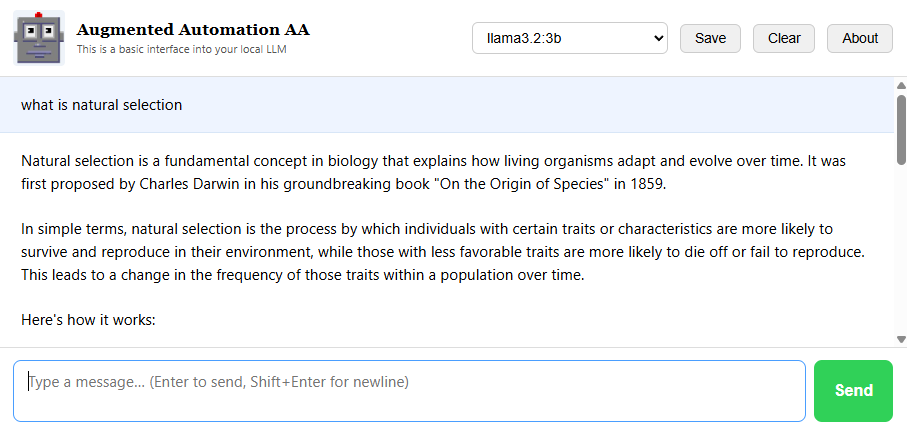
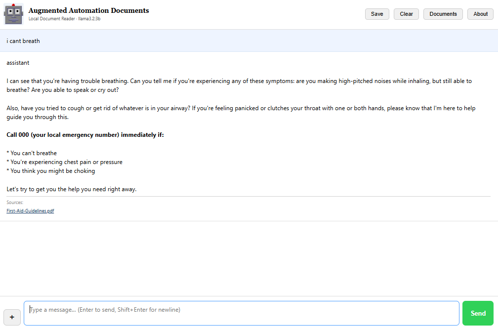

# Augmented Automation Basic AA01

<p align="center">
  
</p>

## 
- [Augmented Automation Documents AA02](#Augmented-Automation-Documents-02)
- [Augmented Automation Iteration Reporting AA03](#Augmented-Automation-Iteration-Reporting-03)
- [Augmented Automation Control AA04](#Augmented-Automation-Control-04)
- [Release Notes](#Release-Notes)
  
  
Overview
--------

This is a small Docker-based application that provides access to a local Large Language Model (LLM). It can be easily downloaded and deployed on any infrastructure that supports Docker.

The application is designed to be lightweight and simple to use, providing a basic web interface for end users to interact with an LLM without the complexity of a full-featured AI platform.

Features
--------

- Lightweight Docker deployment
- Simple end-user interface
- Connects to a locally hosted LLM (such as Ollama)
- Minimal configuration required
- Suitable for in-house AI usage

Design Goals
------------

This project focuses on simplicity rather than advanced functionality. It is intended as a straightforward access portal to a local LLM, providing users with an easy way to submit prompts and receive responses.


User Interface
--------------

The User Interfaces are in house built Docker images, which can reside
on a VM host and only need the LLM network address. Using docker images
allows for easy install, duplication and modification with little
knowledge needed to install and run them as required.

*Docker images built by JSAAD provide*

-   Standalone pre built application functions for in house LLM

-   Total source control

-   Easy deployment and BAU support

-   Highly flexible for changing needs

-   Cheap (but not nasty)


**User interface**

This is an UNCLASSIFIED web interface
demonstrating interaction with local documents.



AA01 - Local LLM Web Interface
==============================

A simple web-based chat interface for Ollama, packaged as a Docker container
for deployment on offline hosts.

PROJECT STRUCTURE
-----------------
```
  Dockerfile          - Container build definition
  docker-compose.yml  - Compose config with Ollama URL setting
  .dockerignore       - Files excluded from Docker build context
  requirements.txt    - Python dependencies (FastAPI, uvicorn, httpx)
  main.py             - FastAPI backend server
  static/index.html   - Web UI (single page, no build step)
```


REQUIREMENTS
------------
  - Docker installed on the target host
  - Ollama running and accessible from the container


BUILD 
------

  1. On the internet-connected machine, build the image:

       docker build -t aa01:latest .

  2. Save the image to a tarball:

       docker save aa01:latest | gzip > aa01.tar.gz

STARTING
--------

  1. Copy aa01-v*-docker-image.tar.gz to the  host (USB drive, scp, etc.)

  2. On the offline host, load and start:

       docker load < aa01-v*-docker-image.tar.gz
       docker compose up -d
       or
       docker run -d --name aa01 -p 8080:8080 -e OLLAMA_URL=http://{ollama host}:11434 aa01:latest

  3. Open a browser and go to:

       http://localhost:8080


CONNECTING TO OLLAMA
---------------------
  Edit the OLLAMA_URL value in docker-compose.yml to match your setup:

    host.docker.internal:11434   - Ollama on the Docker host (Linux with extra_hosts set)
    172.17.0.1:11434             - Alternative for Linux Docker hosts
    ollama:11434                 - Ollama running as a separate Docker container

  The extra_hosts entry in docker-compose.yml maps host.docker.internal to
  the host gateway on Linux automatically.


USAGE
-----
  - Select a model from the dropdown (top right)
  - Optionally enter a system prompt in the left sidebar
  - Type a message and press Enter to send (Shift+Enter for newline)
  - Use "Clear chat" to reset the conversation history

   

MODELS
------
```

codestral            # coding
llama3.3:70b         # RAG + reasoning
nomic-embed-text     # embeddings
mxbai-embed-large    # embeddings
llama3.2-vision:11b  # image processing
bge-large-en-v1.5    # Reranker model
gpt-oos:20b          # Reranker model
gpt-oos-Safeguard    # Applies safety policies
gemma3:27b           # Google's family
granite4.1:3b        # IBM  family
nemotron-3-nano      # Nvidia family
magistral            # Advanced reasoning and planning
mixtral:8x7b         # maths and coding capabilities

```


## Augmented Automation Documents 02

AA02 - Local LLM Web Interface with RAG
========================================

A web-based chat interface for Ollama with a RAG (Retrieval-Augmented Generation)
repository. Drop markdown files into the docs folder, run the indexer once, then
start the chat server. The chat will only answer from the indexed documents.

PROJECT STRUCTURE
-----------------
```
  Dockerfile          - Container build definition
  docker-compose.yml  - Compose config with Ollama URL and volume mounts
  .dockerignore       - Files excluded from Docker build context
  requirements.txt    - Python dependencies (FastAPI, uvicorn, httpx, numpy)
  main.py             - FastAPI backend server
  rag.py              - RAG logic (chunking, embedding, search)
  index_docs.py       - Standalone indexing script (run once before starting server)
  manage_users.py     - CLI tool to add/remove users (run before starting server)
  static/index.html   - Web UI (single page, no build step)
  docs/               - Drop .md files here before indexing
  index/              - Persisted embeddings index (survives container restarts)
  logs/               - Server-side chat history, one .txt file per day
  context.md          - System-prompt context, loaded once at container startup
  users.json          - Hashed user credentials (created by manage_users.py)
```

FEATURES
--------
  - Model selector (auto-populated from Ollama at startup)
  - RAG answers restricted to indexed documents only
  - If no relevant content is found, asks the user for more detail
  - Source filenames shown under each assistant reply
  - Multi-turn chat history (per session)
  - Save conversation to a timestamped .txt file
  - Every question/answer is also logged server-side to logs/ automatically
  - Clear chat button
  - About popup with version and support info
  - Per-user login with individual passwords (optional)


**User interface**

This is an UNCLASSIFIED web interface
demonstrating interaction with local documents.



REQUIREMENTS
------------
  - Docker installed on the target host
  - Ollama running and accessible (default: http://ollama:11434)
  - nomic-embed-text model pulled in Ollama:
      ollama pull nomic-embed-text   (run this on the Ollama host)


BUILD
-----

  1. Copy the logo from AA into the static folder:

       cp $(path)/your_image.png $(path)/static/J7.png

  2. On the internet-connected machine, build the image:

       docker build -t aa02:latest .

STARTING
--------

  1. Save the image to a tarball:

       docker save aa02:latest | gzip > aa02.tar.gz

  2. Copy aa01-v*-docker-image.tar.gz to the  host (USB drive, scp, etc.)

  3. On the offline host, load the image:

       docker load < aa01-v*-docker-image.tar.gz


INDEXING DOCUMENTS (run once before starting the server)
---------------------------------------------------------

  1. Place .md files into the docs/ folder on the host machine

  2. Run the indexer (this calls Ollama to generate embeddings):

```
       docker run --rm \
         -e OLLAMA_URL=http://{ollama}:11434 \
         -v $(pwd)/docs:/app/docs \
         -v $(pwd)/index:/app/index \
         --add-host host.docker.internal:host-gateway \
         aa02:latest python index_docs.py
```

  3. The indexer will print progress and confirm when done:

       Found 3 file(s): guide.md, policy.md, notes.md
       Indexing... (this may take a few minutes)
       Done: 3 file(s), 47 chunks indexed.

  Re-run the indexer any time you add or change files in docs/,
  then restart the chat container to pick up the new index.


STARTING THE CHAT SERVER
-------------------------
```
       docker run -d --name aa02 \
         -p 8081:8080 \
         -e OLLAMA_URL=http://ollama:11434 \
         -v $(pwd)/docs:/app/docs \
         -v $(pwd)/index:/app/index \
         -v $(pwd)/logs:/app/logs \
         -v $(pwd)/context.md:/app/context.md \
         -v $(pwd)/users.json:/app/users.json \
         --add-host host.docker.internal:host-gateway \
         aa02:latest
```

  Open a browser and go to:

```
       http://localhost:8081
```

HOW RAG WORKS
-------------
  - Each message is embedded and compared against the indexed document chunks
  - Only chunks above the relevance threshold (default 0.45) are used
  - The model is instructed to answer ONLY from those chunks
  - If nothing relevant is found, the user is asked to rephrase or provide
    more detail — the model will not fall back to general knowledge
  - Sources cited below each reply show which documents were referenced

  The relevance threshold can be tuned via environment variable:
    -e RELEVANCE_THRESHOLD=0.50   (stricter — fewer but more confident matches)
    -e RELEVANCE_THRESHOLD=0.35   (more lenient — broader matches)


SYSTEM CONTEXT
--------------
  context.md, in the project root, is read once when the container starts
  and its contents are prepended to every chat's system prompt (persona,
  tone, standing instructions, etc.) — separate from the indexed RAG docs
  in docs/. Edit context.md and restart the container to pick up changes.

  The file path can be relocated via environment variable:
    -e CONTEXT_FILE=/app/context.md   (default)

  If the file is missing or empty, the app runs with no extra context.


USER AUTHENTICATION
-------------------
  Access can be restricted to named users, each with their own password.
  Authentication is optional — if users.json does not exist the app is open.

  SETUP (run before starting the container):

    python3 manage_users.py add alice  secretpass
    python3 manage_users.py add bob    otherpass
    python3 manage_users.py list
    python3 manage_users.py remove bob

  Or inside a running container:

    docker exec aa02 python manage_users.py add alice secretpass

  IMPORTANT: create users.json before starting the container. If the container
  starts without the file present, Docker will create a directory at that path
  and the app will fail. If this happens:

    docker compose down
    rm -rf users.json
    python3 manage_users.py add <username> <password>
    docker compose up -d

  Passwords are hashed with PBKDF2-SHA256 (100,000 rounds). Each login gets
  an independent session cookie — a container restart clears all sessions and
  users must log in again.

  The users file path can be relocated via environment variable:
    -e USERS_FILE=/app/users.json   (default)


CHAT LOGGING
------------
  Every question and answer is appended server-side to a plain-text log,
  independent of the browser's Save button. Logs are written to /app/logs
  inside the container — mount that path to a host folder (see the docker
  run command above) so logs survive container restarts.

  One file per calendar day: logs/chat-YYYY-MM-DD.txt
  Each entry looks like:

    [2026-07-11 14:32:07] model=qwen2.5 user=alice
    User: <question>
    Assistant: <answer>
    Sources: file1.md, file2.md

    ---

  The user= field is included when authentication is enabled.

  The log directory can be relocated via environment variable:
    -e LOG_DIR=/app/logs   (default)


PDF SOURCE SERVER (httpd)
--------------------------
  Each "Sources:" link in the chat UI points to a PDF served by a separate
  Apache httpd container (my-httpd) running on the same host as aa02,
  on port 80. The link is built in the browser as:

       http://<hostname>/<source-file-basename>.pdf

  where <source-file-basename> matches the indexed document's filename
  with the extension swapped to .pdf (e.g. First-Aid-Guidelines.md -> First-Aid-Guidelines.md), and
  <hostname> is whatever hostname/IP is used to reach the chat UI.

  BUILD & TRANSFER (offline transfer, same pattern as aa02)

  1. On the internet-connected machine, save the httpd image:

       docker save httpd:latest | gzip > httpd.tar.gz

  2. Copy httpd.tar.gz to the offline host, along with the PDF files
     (the ones matching your indexed documents, e.g. First-Aid-Guidelines.pdf)

  3. On the offline host, load the image:

       docker load < httpd.tar.gz

  STARTING THE HTTPD SERVER

  4. Place the PDF files into a folder on the host, e.g. /DOCS
     (filenames must match the indexed document basenames, with a .pdf
     extension)

  5. Start the container:

       docker run -d --name my-httpd \
         -p 80:80 \
         -v /DOCS:/usr/local/apache2/htdocs \
         httpd:latest

  6. Verify it's serving files by browsing to:

       http://localhost/<file>.pdf

  Note: port 80 must be free on the host. If it's in use, change the
  host-side port (e.g. -p 8080:80) — but the Sources: links in the chat
  UI assume port 80, so you would also need to update the frontend
  (static/index.html, sourcePdfUrl function) to include the new port.


CONVERTING PDF TO MARKDOWN
--------------------------
 
   https://github.com/microsoft/markitdown
 
  A local docker container was built to convert adhoc new file to md 
   docker load -i markitdown-latest-amd64.tar.gz
   docker run --rm -i markitdown:latest < yourfile.pdf > output.md


USAGE
-----
  - Select a model from the dropdown (top right)
  - Type a message and press Enter to send (Shift+Enter for newline)
  - Sources cited below each reply show which docs were used
  - Use Save to download the conversation as a timestamped .txt file
  - Use Clear to reset the conversation history

## Augmented Automation Iteration Reporting 03

## Augmented Automation Control 04

## Release Notes

```
Augmented Automation Basic 01
v 0.5   user interface change
v 0.3   user interface change
v 0.2	user interface change
v 0.1	base build


Augmented Automation Documents 02
v 0.7   cleaned redundant code
v 0.6   per-user authentication with individual passwords (manage_users.py)
v 0.5   context.md loaded at container startup, folded into system prompt
v 0.4   add index ref and button
v 0.3	Prompt change English only
v 0.3	Chat history saved to local file
v 0.2	RAG ingestion and prompt docs only
v 0.1	base build


		
Augmented Automation Iteration Reporting 03
v 0.1   base build

Augmented Automation Control 04

```


## Single-endpoint limitation

> `main.py` reads one `OLLAMA_URL` at container startup and sends every
> request there — aa01 cannot address both services at once, and there's no
> in-app switcher. To move traffic to the other GPU's service, edit
> `OLLAMA_URL` in `docker-compose.yml` and run `docker compose up -d`. It's
> an environment variable, not baked into the image, so no rebuild is
> needed.
